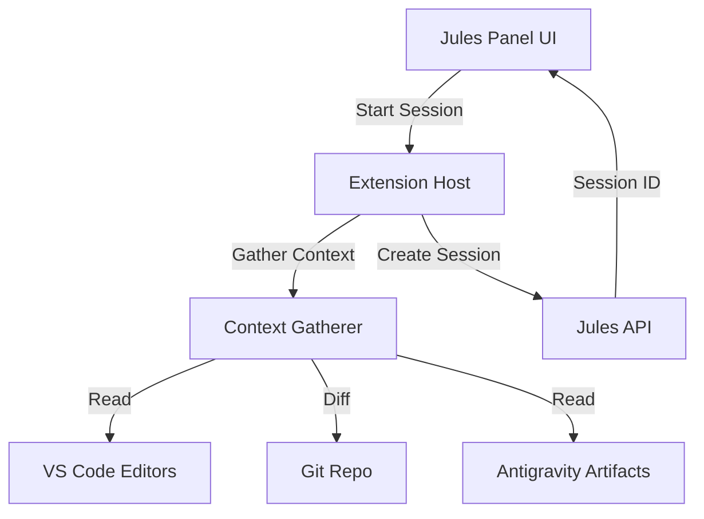

# Developer Documentation

This document outlines the internal architecture of `antigravity-jules-integration`. 

> **New to the project?** Start with the **[Contribution Guide](CONTRIBUTING.md)**.
> **Just want to use it?** See the **[User Guide](README.md)**.

## Architecture

The extension is built on a modular architecture designed for security, maintainability, and extensibility.



### 1. Core Components

- **`extension.ts`**: Entry point. Orchestrates component initialization and wiring.
- **`JulesPanel.ts`**: `WebviewViewProvider` that manages the React-like HTML UI and handles message passing.
- **`julesClient.ts`**: Robust HTTP client for the Jules API. Handles retries, timeouts, and error sanitization.
- **`ContextGatherer.ts`**: Automates context collection from VS Code (editors, git, artifacts).
- **`BridgeServer.ts`**: MCP (Model Context Protocol) server that allows local Antigravity agents to delegate tasks to Jules.

### 2. Context Automation Flow

When a user starts a session:
1. `JulesPanel` receives the "createSession" message.
2. `ContextGatherer` is invoked:
   - Reads active editor content & cursor position.
   - Runs `git diff` to capture uncommitted changes.
   - Reads `task.md` and `implementation_plan.md` from `~/.gemini/antigravity`.
   - Collects active compilation errors (diagnostics).
3. `ContextGatherer` compiles this into an XML prompt.
4. `JulesClient` sends the XML prompt to `https://jules.googleapis.com/v1alpha/sessions`.

### 3. MCP Integration ("The Bridge")

The extension exposes a local MCP server (`jules-bridge`) via Stdio.
- **Tool**: `delegate_to_jules`
- **Arguments**: `task` (string)
- **Function**: Allows OTHER agents (like the Antigravity Chatbot) to programmatically start Jules sessions.
- **Implementation**: `BridgeServer.ts` reuses the `ContextGatherer` to ensure agents get the same rich context as human users.

## Folder Structure

```
src/
├── context/         # Context gathering logic
│   └── ContextGatherer.ts
├── mcp/             # MCP Server & Bridge implementation
│   ├── BridgeServer.ts
│   └── registration.ts
├── panels/          # Webview UI
│   ├── JulesPanel.ts
│   └── panelContent.ts
├── extension.ts     # Entry point
├── julesClient.ts   # API Client
├── gitContext.ts    # Legacy Git helpers (to be deprecated)
├── secrets.ts       # Secure storage wrapper
└── antigravityDetector.ts
```

## Build & Test

- **Compile**: `npm run compile`
- **Package**: `npx vsce package`
- **Install**: Extract VSIX to `~/.antigravity/extensions/`

## Troubleshooting

- **404 Errors**: Check `julesClient.ts` endpoint `BASE_URL`. Ensure repo is installed in Jules App.
- **Registration Errors**: Ensure `antigravity.mcpServers` setting is NOT accessed directly (use file-based config).
