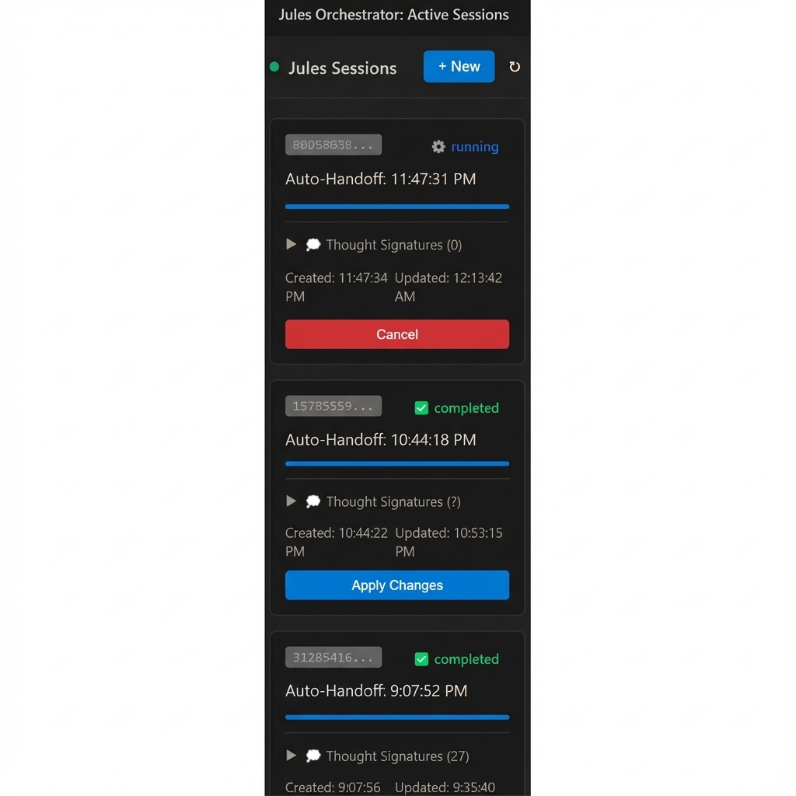
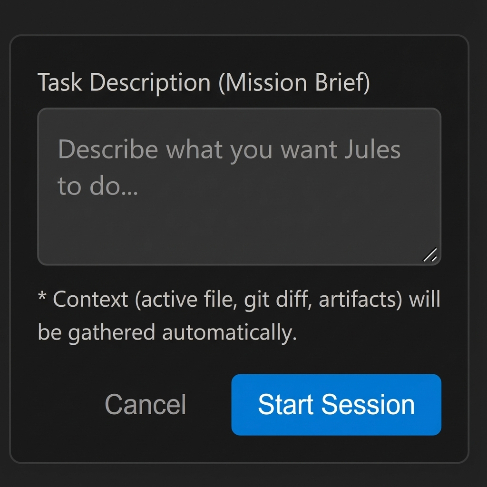

# Jules for Antigravity

[](https://marketplace.visualstudio.com/items?itemName=antigravity-platform.antigravity-jules-integration)


**Jules for Antigravity** is a powerful bi-directional bridge that connects your local coding agents (like Antigravity) with **Google Jules**, an advanced autonomous remote coding agent.

> **🤝 Bridging Local Agents & Cloud AI:** This extension allows your local agents to "phone a friend" by delegating complex, long-running tasks to Jules in the cloud, while maintaining full context of your local workspace.

> [!NOTE]
> **Compatibility Notice**: This extension currently **requires [Antigravity](https://antigravity.dev)** to function. A standalone VS Code version will be released soon.

<div align="center">

[](https://github.com/sajid-mah-m/antigravity-jules-integration/issues/new)
[](https://github.com/sajid-mah-m/antigravity-jules-integration/compare)

</div>

## Screenshots

<div align="center">
  
  
</div>

## Features

- **🚀 Two-Way Agent Bridge:** Enable local agents to programmatically start Jules sessions via MCP (Model Context Protocol).
- **🧠 Automated Context:** Automatically gathers active files, Git diffs, and Antigravity artifacts to give Jules full context without manual uploads.
- **⚡ Lazy Loading:** Efficiently loads session logs on-demand to save bandwidth and API quota.
- **🚦 Robust Quota Management:** Intelligent retry logic with exponential backoff handles API rate limits automatically.
- **🔄 Bi-Directional Sync:** View Jules' thought process in real-time and apply changes directly to your local Git branch.
- **🛡️ Secure:** Uses VS Code Secret Storage for API keys and sanitizes all error messages.

## Installation

1. **Install Antigravity IDE** or the VS Code extension.
2. Search for "Jules for Antigravity" in the Extensions view.
3. Click Install.

## Configuration

Before you can start sessions, you must configure your access credentials.

### 1. Prerequisites
*   **Install the GitHub App:** You must install the [Jules GitHub App](https://jules.google.com/settings/repositories) on the repositories you wish to use.
*   **Enable the API:** Ensure the **Jules API** is enabled in your Google Cloud Project.

### 2. Get Your API Key
1. Go to the [Google Cloud Console Credentials Page](https://console.cloud.google.com/apis/credentials).
2. Create a new API Key (or use an existing one).
3. Copy the key string (starts with `AIza...`).

### 3. Add Key to Extension
1. Open Visual Studio Code.
2. Open the Command Palette (`Ctrl+Shift+P` or `Cmd+Shift+P`).
3. Type and select **`Jules: Set API Key`**.
4. Paste your API Key and press Enter.

> 🔒 **Security Note:** Your key is stored securely in the local operating system's Keychain/Credential Manager using VS Code's SecretStorage API.

## Usage Guide

### 1. Manual Handoff ("Click-to-Run")
Perfect for when you want to delegate a task yourself.
1. Open the **Jules Orchestrator** panel in the Activity Bar.
2. Click **+ New Season**.
3. Type your Mission Brief (e.g., *"Refactor the auth middleware to use the new JWT library"*).
4. Click **Start Session**.
   * *Context (files, diffs, plans) is gathered automatically.*

### 2. Agentic Handoff (The Bridge)
Your local Antigravity agent can call Jules directly:
```json
{
  "tool": "delegate_to_jules",
  "arguments": {
    "task": "Analyze the security of the payment module"
  }
}
```
This enables "Agent-to-Agent" collaboration, where your local assistant orchestrates larger goals by sub-contracting work to Jules.

## Architecture

This extension uses a **Hybrid Agentic Architecture**:
- **Local:** Runs as a VS Code extension + MCP Server for low-latency context gathering.
- **Remote:** Connects to `jules.googleapis.com` for heavy-lifting autonomous coding.

For a deep dive into the internal components (`BridgeServer`, `ContextGatherer`), please read our **[Developer Documentation](DEVELOPMENT.md)**.

## Documentation

For more detailed information, please check the [docs/](https://github.com/sajid-mah-m/antigravity-jules-integration/tree/master/docs) folder:
- [Architecture Guide](https://github.com/sajid-mah-m/antigravity-jules-integration/blob/master/docs/Architecture.md)
- [Troubleshooting](https://github.com/sajid-mah-m/antigravity-jules-integration/blob/master/docs/Troubleshooting.md)
- [Home](https://github.com/sajid-mah-m/antigravity-jules-integration/blob/master/docs/Home.md)

## Contributing

We welcome contributions! Whether you're fixing bugs, improving the context gathering logic, or adding new bridge capabilities, help us build the future of multi-agent coding.

### How to Contribute
1. Fork the repository.
2. Read the **[Contribution Guide](CONTRIBUTING.md)** for setup instructions.
3. Create a feature branch and submit a PR.

## 👨‍💻 Author

**Sajid Mahamud**
- [Portfolio](https://sajidmahamud835.github.io/)

## License

Distributed under the **MIT License**. See [`LICENSE`](LICENSE) for more information.

---

## 🔗 Related Projects

- **[MarketSync EA](../MarketSync-EA)** - Autonomous trading agent using GPT-4 and ML.
- **[BankSync](../banksync)** - Complex financial integration with Plaid and Web3.
- **[EasyCom](../easycom)** - Large-scale application architecture reference.

## 🏷️ Tags

`VS Code Extension` `AI Agent` `Google Jules` `Antigravity` `TypeScript` `Automation` `DevTools`
