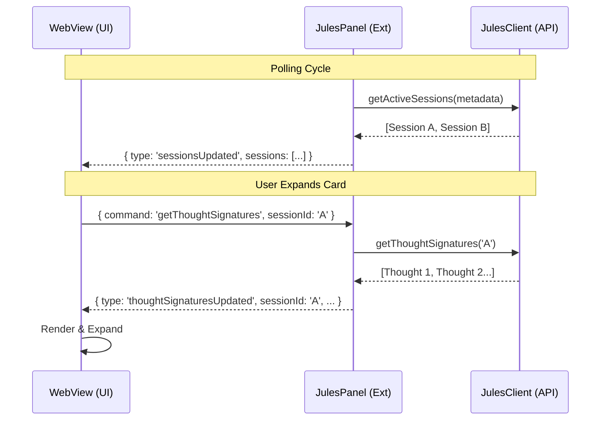

# Architecture Guide

The extension follows a modular architecture designed for stability and maintainability.

## 1. API Client (`src/julesClient.ts`)

This is the bridge to Google's Jules API.
*   **Responsibility**: Authenticate, create sessions, fetch status.
*   **Key Mechanic**: `executeWithRetry<T>` wrapper.
    *   Wraps all network calls.
    *   Catches `429` (Rate Limit) & `503` (Service Unavailable).
    *   Retries with exponential backoff (1s -> 2s -> 4s...).

## 2. Panel Controller (`src/panels/JulesPanel.ts`)

Manages the WebView and data flow.
*   **Polling Loop**: Runs every 5 seconds.
    *   *Optimization*: Only calls `getActiveSessions` (metadata only).
    *   Does NOT fetch thought signatures automatically.
*   **Lazy Loading**:
    *   Listens for `getThoughtSignatures` command from UI.
    *   Fetches detailed logs for *one* session ID.
    *   Sends `thoughtSignaturesUpdated` event back to UI.

## 3. View Layer (`src/panels/panelContent.ts`)

Pure HTML/CSS/JS frontend.
*   **State**: Local `sessions` array and `thoughtSignatures` Map.
*   **Interactivity**:
    *   Clicking "New Session" -> Sends command to Extension.
    *   Clicking Chevron -> Checks if data exists. If no, sends `getThoughtSignatures`.

## Data Flow Diagram

